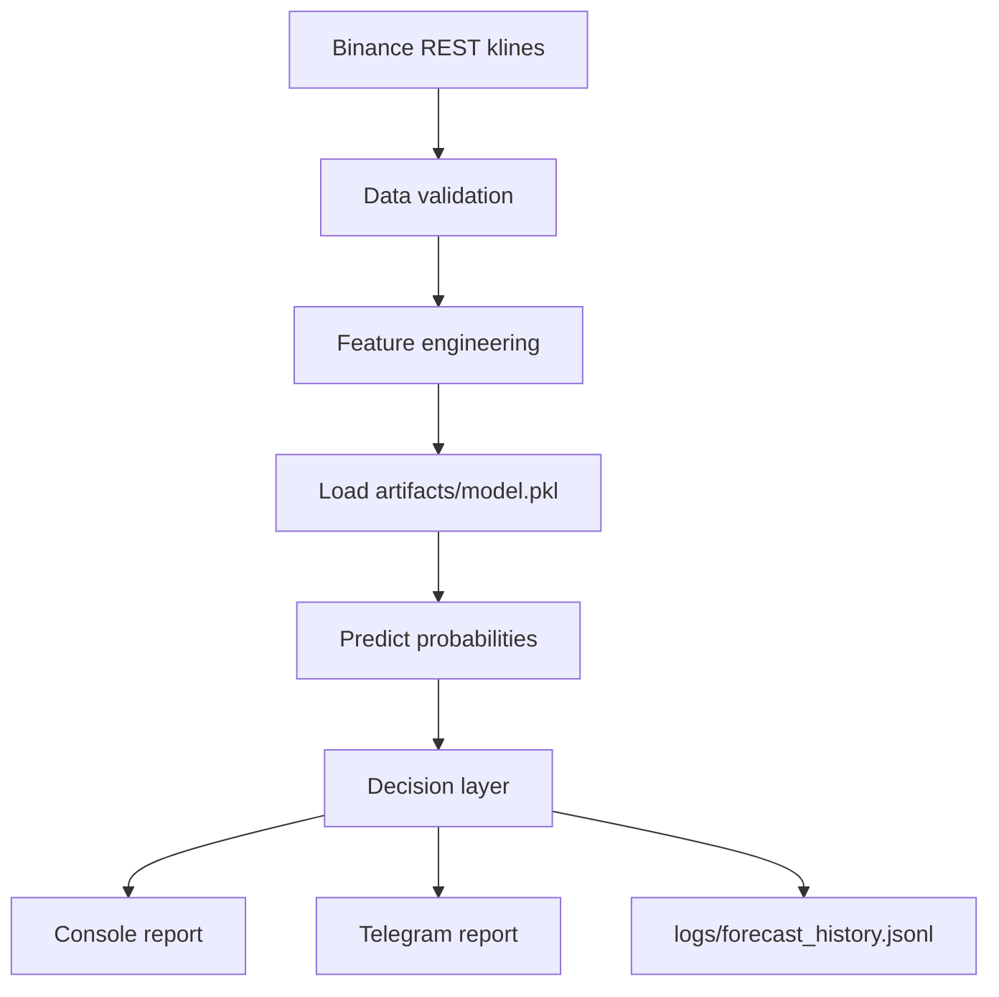

<div align="center">
  <h1>BTC Daily Forecast Bot</h1>
  <p><strong>BTCUSDT • XGBoost • Daily/Hourly forecast runtime</strong></p>
  <p>Аккуратный runtime для загрузки свечей Binance, расчёта вероятностного прогноза по BTC и публикации отчёта в stdout или Telegram.</p>
  <p>Бот не торгует и не переобучает модель на лету: он использует подготовленные артефакты, применяет decision layer и сохраняет историю прогнозов.</p>

  <p>
    
    
  </p>
</div>

## What the bot does

- Загружает OHLCV-свечи Binance через REST `klines`.
- Валидирует структуру данных и шаг по времени.
- Собирает признаки, совместимые с обученной XGBoost-моделью.
- Загружает `artifacts/model.pkl` и runtime-конфиг артефактов.
- Возвращает вероятности `UP / DOWN / UNSURE` через `predict_proba`.
- Применяет лёгкий decision layer и порог уверенности.
- Печатает отчёт в stdout.
- Опционально отправляет этот же отчёт в Telegram.
- Сохраняет историю запусков в `logs/forecast_history.jsonl`.

## Architecture / Flow



## Runtime flow

1. `run_daily_bot.py` запускает runtime и собирает настройки из environment variables и JSON-артефактов.
2. `app.binance_loader` загружает свежие свечи Binance и проверяет целостность OHLCV-данных.
3. `app.predictor` строит feature frame, загружает сериализованную модель и считает вероятности.
4. `app.reporter` форматирует человекочитаемый отчёт и при необходимости отправляет Telegram-сообщение.
5. `app.runtime` дописывает результат в `logs/forecast_history.jsonl`.

## Project structure

```text
.
├── app/
│   ├── binance_loader.py
│   ├── predictor.py
│   ├── reporter.py
│   ├── runtime.py
│   └── settings.py
├── artifacts/
│   ├── decision_config.json
│   ├── feature_columns.json
│   ├── model.json
│   ├── model_meta.json
│   └── training_config.json
├── tests/
├── .env.example
├── Dockerfile
├── docker-compose.yml
├── requirements.txt
├── run_daily_bot.py
└── run_daily_boy.py
```

`run_daily_boy.py` оставлен только как compatibility wrapper. Основной entrypoint: `run_daily_bot.py`.

## Required artifacts

В `artifacts/` runtime ожидает такие файлы:

- `model.pkl` - сериализованная модель, совместимая с `joblib.load`.
- `feature_columns.json` - упорядоченный список колонок, которые ожидает модель.
- `model_meta.json` - метаданные модели, включая `symbol`, `timeframe` и `model_version`.
- `training_config.json` - training/runtime-параметры вроде `expected_freq` и `lookback_bars`.
- `decision_config.json` - настройки decision layer и репортинга.

Важно: в репозитории сейчас лежат JSON-метаданные и legacy `model.json`, но сам runtime работает в fail-fast режиме и требует валидный `model.pkl`.

## Environment variables

Поддерживаются такие переменные:

- `ARTIFACTS_DIR=artifacts`
- `TELEGRAM_ENABLED=false`
- `TELEGRAM_BOT_TOKEN=`
- `TELEGRAM_CHAT_ID=`
- `BINANCE_SYMBOL=BTCUSDT`
- `BINANCE_INTERVAL=1h`
- `LOOKBACK_BARS=500`
- `DECISION_MARGIN=0.10`
- `REQUEST_TIMEOUT_SECONDS=20`
- `LOG_LEVEL=INFO`
- `DRY_RUN=false`
- `TZ=UTC`
- `USE_CLOSED_CANDLE_ONLY=true`

Приоритет такой:

1. Значения из environment variables.
2. Значения из `decision_config.json`, `training_config.json` и `model_meta.json`.
3. Безопасные runtime defaults.

Пример `.env`:

```env
ARTIFACTS_DIR=artifacts
TELEGRAM_ENABLED=false
TELEGRAM_BOT_TOKEN=
TELEGRAM_CHAT_ID=
BINANCE_SYMBOL=BTCUSDT
BINANCE_INTERVAL=1h
LOOKBACK_BARS=500
DECISION_MARGIN=0.10
REQUEST_TIMEOUT_SECONDS=20
LOG_LEVEL=INFO
DRY_RUN=false
TZ=UTC
USE_CLOSED_CANDLE_ONLY=true
```

## Local run

1. Создать виртуальное окружение и установить зависимости:

```bash
python3 -m venv .venv
. .venv/bin/activate
pip install -r requirements.txt
```

2. Подготовить переменные окружения:

```bash
cp .env.example .env
```

3. Экспортировать переменные и запустить бота:

```bash
set -a
. ./.env
set +a
python run_daily_bot.py
```

Если Telegram credentials не заданы или `TELEGRAM_ENABLED=false`, бот не падает и просто пропускает отправку.

## Docker run

Сборка образа:

```bash
docker build -t btc-daily-bot .
```

Запуск контейнера:

```bash
docker run --rm --env-file .env -v "$(pwd)/artifacts:/app/artifacts:ro" -v "$(pwd)/logs:/app/logs" btc-daily-bot
```

## Docker Compose

```bash
cp .env.example .env
docker compose up --build bot
```

## Example output

```text
2026-04-17 08:00:00,000 INFO __main__ Starting BTC analyzer: symbol=BTCUSDT timeframe=1h lookback=500 dry_run=False
2026-04-17 08:00:01,234 INFO __main__ Loading market data from Binance
2026-04-17 08:00:02,345 INFO predictor Loading model artifact from artifacts/model.pkl
============================================================
BTC Daily Outlook

Symbol: BTCUSDT
Timeframe: 1h
Forecast time: 2026-04-17T08:00:02.500000+00:00
Model version: btc_h1_xgb_v1

Probabilities:
- UP: 41.20%
- DOWN: 27.35%
- UNSURE: 31.45%

Decision: UP
Confidence: 9.75%

Market context:
- Phase: bullish
- Volatility: normal
- Momentum: positive
============================================================
```

## Telegram behavior / optional notifications

- Оставьте `TELEGRAM_ENABLED=false`, чтобы бот работал только через stdout и всё равно писал историю в `logs/forecast_history.jsonl`.
- Установите `TELEGRAM_ENABLED=true` вместе с `TELEGRAM_BOT_TOKEN` и `TELEGRAM_CHAT_ID`, чтобы включить отправку в Telegram.
- Если Telegram включён, но credentials не заданы, runtime пропустит отправку и оставит warning в логах вместо падения.

## Updating model artifacts

1. Экспортировать новую обученную модель в `artifacts/model.pkl`.
2. Обновить `artifacts/feature_columns.json`, если поменялся feature set.
3. Обновить `artifacts/model_meta.json` с новой `model_version`.
4. При необходимости скорректировать `artifacts/training_config.json`.
5. При необходимости скорректировать `artifacts/decision_config.json`.

После этого можно перезапустить бота без изменения application code.

## CI

GitHub Actions запускается на каждом `push` в `main` и на `pull_request` в `main`.

- Python 3.11 поднимается через `actions/setup-python`.
- Зависимости ставятся из `requirements.txt` с кэшем `pip`.
- Дополнительно выполняется лёгкая syntax-проверка через `python -m compileall`.
- Затем запускается тестовый набор через `pytest -q`.

Файл workflow: `.github/workflows/ci.yml`.
